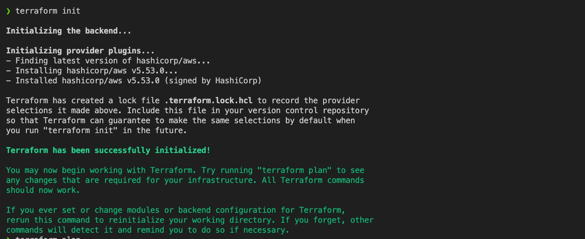
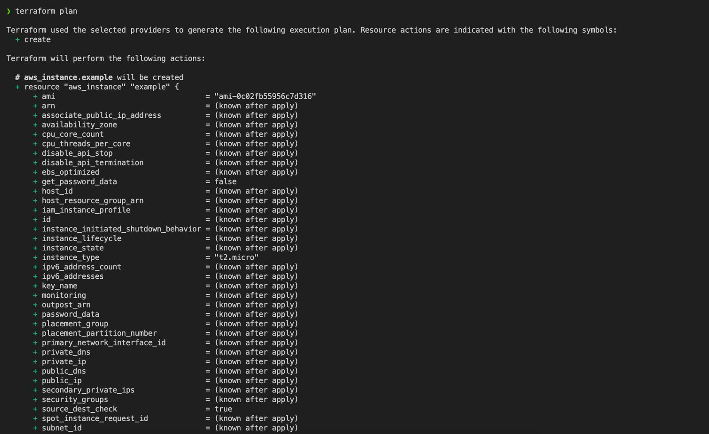
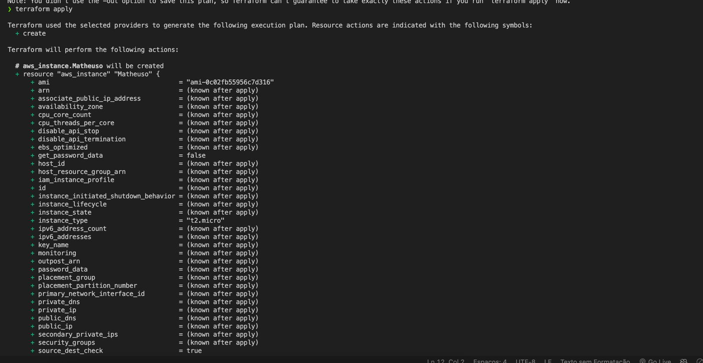
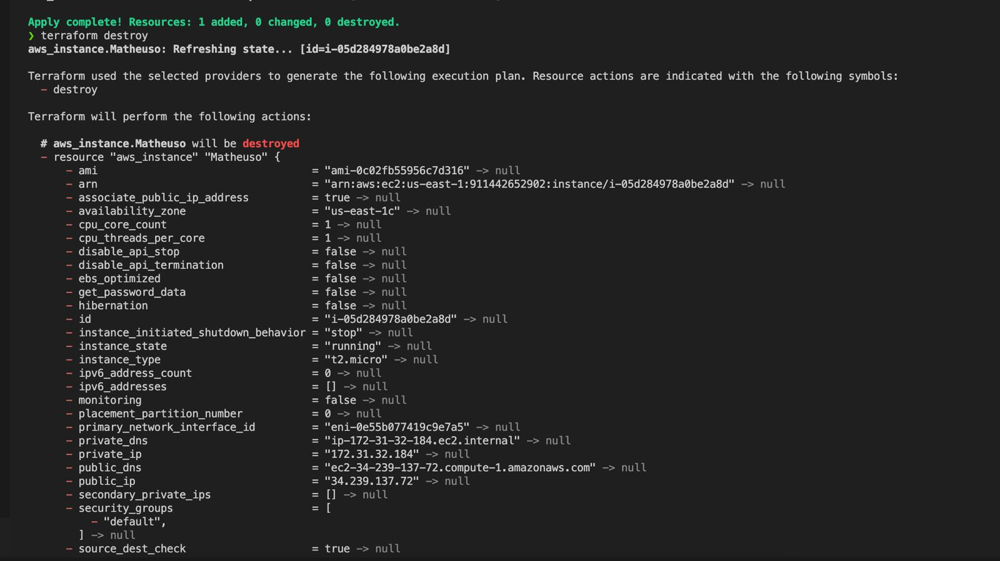

# Infraestrutura como Código com Terraform

Este projeto demonstra como utilizar o Terraform para criar e gerenciar recursos na nuvem de forma automatizada e reproduzível. Utilizar o Terraform como IaC permite que você descreva a infraestrutura desejada através de arquivos de configuração, tornando mais fácil a manutenção e a escalabilidade dos recursos.

## Pré-requisitos

Antes de iniciar, certifique-se de ter os seguintes itens instalados e configurados:

- [Terraform](https://www.terraform.io/downloads.html)
- Conta em um provedor de nuvem (AWS, Azure, GCP, etc.)
- Configuração das credenciais do provedor de nuvem

## Passo a Passo

### Inicialização do Terraform

O primeiro passo é inicializar o Terraform no seu diretório de projeto. Este comando prepara o diretório de trabalho, baixando os plugins necessários.

```sh
terraform init
```


**Print do Terraform Init:**



### Planejamento da Infraestrutura

O próximo passo é criar um plano de execução. O comando `terraform plan` gera um plano de execução que mostra o que será criado, modificado ou destruído. Este comando é importante para visualizar as mudanças antes de aplicá-las.

```sh
terraform plan
```

**Print do Terraform Plan:**



### Aplicação das Configurações

Após revisar o plano, aplique as configurações usando o comando `terraform apply`. Este comando realiza todas as ações necessárias para criar a infraestrutura descrita nos arquivos de configuração. Você será solicitado a confirmar a aplicação do plano.

```sh
terraform apply
```

**Print do Terraform Apply:**



### Destruição da Infraestrutura

Para destruir todos os recursos provisionados, utilize o comando `terraform destroy`. Este comando remove todos os recursos gerenciados pelo Terraform, garantindo que você não tenha recursos desnecessários sendo cobrados na sua conta de nuvem.

```sh
terraform destroy
```

**Print do Terraform Destroy:**



## Itens Provisionados

Os seguintes itens foram provisionados na nuvem utilizando o Terraform:

- **Instâncias de Máquina Virtual**: Máquinas virtuais configuradas para rodar aplicações específicas.
- **Grupos de Segurança**: Regras de firewall que controlam o tráfego de entrada e saída para as instâncias.
- **Buckets de Armazenamento**: Contêineres de armazenamento de objetos, utilizados para armazenar arquivos e dados.


## Conclusão

Este projeto demonstrou como utilizar o Terraform para gerenciar infraestrutura na nuvem de forma eficiente e organizada. A utilização do Terraform como IaC proporciona benefícios como repetibilidade, versionamento e fácil gerenciamento da infraestrutura. Este processo facilita a escalabilidade e a manutenção dos recursos, garantindo que todos os itens necessários sejam provisionados de forma automatizada e controlada.


